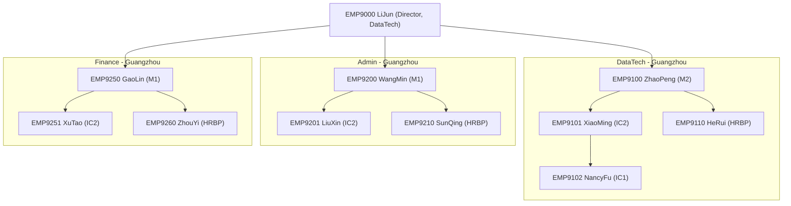

# Org Hierarchy Reference - FTE_CN_GZ

Document ID: ORG-HIER-FTE-CN-GZ-2026
Applies To: Full-time employees (FTE) in Guangzhou, China
Effective Date: January 1, 2026

## 1. Org Chart

## 2. Department Set
- Admin
- DataTech
- Finance

## 3. Reporting Chain Policy
- direct manager: employee.manager_id
- skip-level manager: direct manager.manager_id

## 4. HRBP Belonging
HRBP owner is defined by `(department, location)`:
- `(DataTech, Guangzhou)` -> `EMP9110`
- `(Admin, Guangzhou)` -> `EMP9210`
- `(Finance, Guangzhou)` -> `EMP9260`
